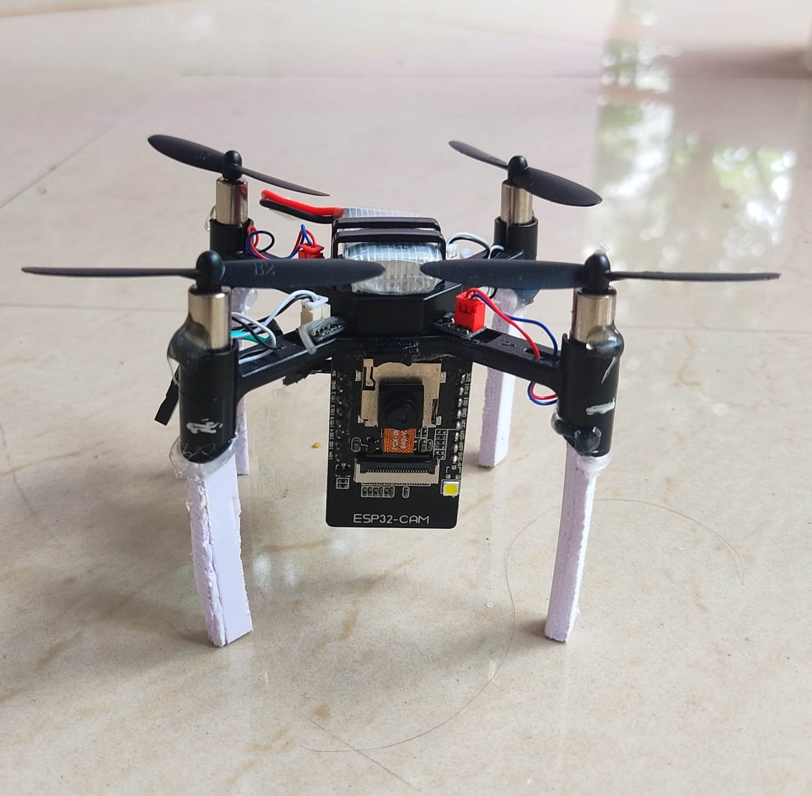

# Defence Drone — ESP32-CAM + YOLOv5 Object Detection System
This project implements a compact **combat surveillance drone** designed for modern defence operations. The drone uses an **ESP32-CAM** for live video transmission and a custom-trained **YOLOv5 model** to detect enemies, weapons, military vehicles, drones and other defence-critical targets in real time. The system is lightweight, difficult to detect by enemy and capable of supporting field surveillance and threat-identification tasks.

## 🎥 Demo Video  
Click the image below to watch the complete drone detection demonstration:
[](https://drive.google.com/file/d/1B1ITPz6EHaWGpLWRDLYI_eK1pHXZUBXJ/view?usp=sharing)

## 📡 System Architecture — Flowchart


**Description:**  
- ESP32-CAM captures live video  
- Video is streamed over WiFi to the host system  
- Python loads the trained YOLOv5 model (`majy8final.pt`)  
- Real-time detection of weapons, persons, drones, and vehicles  
- Output is displayed with bounding boxes and detection counts  

## 🧠 Custom Machine Learning Model (YOLOv5)
The system uses a YOLOv5 model trained on a **custom defence dataset** created using Roboflow.  
Model features:  
- Optimized for small and moving objects  
- Accurate in variable outdoor lighting  
- Lightweight and fast for real-time inference  
- Final model file: **`majy8final.pt`**

## 📂 Repository Structure
📁 esp32arduino/ → Arduino code for ESP32-CAM WiFi streaming
📄 DEFENCEDRONE.py → Python script for YOLOv5 real-time detection
📄 majy8final.pt → Custom-trained YOLOv5 model
📄 defencedrone.jpg 
📄 flowchart.jpg 
📄 README.md 

## 🔧 How the System Works
### 1️⃣ ESP32-CAM Video Streaming
- ESP32-CAM is programmed using the code inside `esp32arduino/`
- Creates a WiFi video stream accessible via a web IP (e.g., `http://<ip>/stream`)
- Drone transmits live video during flight

### 2️⃣ Python Detection Pipeline
- `DEFENCEDRONE.py` reads the ESP32 stream  
- YOLOv5 model (`majy8final.pt`) analyzes each frame  
- Detects defence-related objects such as:  
  - Enemy  
  - Weapons  
  - Drones  
  - Military vehicles  
  - Person  
- Outputs bounding boxes + confidence scores in real time

## 🚀 Features
- Lightweight and stealthy defence drone  
- Real-time object detection  
- WiFi-based long-range live video streaming  
- Custom defence-trained ML model  
- High detection accuracy for moving objects  
- Ideal for surveillance, patrol and security applications  

## 🛠 Technologies Used
- ESP32-CAM  
- Arduino IDE  
- YOLOv5  
- Roboflow  
- Python, OpenCV, PyTorch  
- Wireless video streaming  
- Custom defence dataset  

## 📝 Setup Instructions
### Program ESP32-CAM
Upload the code from the `esp32arduino/` folder via Arduino IDE.

### Run Python Detection
```bash
python3 DEFENCEDRONE.py
```
Ensure model file is present
Place majy8final.pt alongside the Python script.

View Real-Time Detection
The Python GUI window will show the live detection with labels and confidence.
